# Design Document: GumWall.ai

## Overview

GumWall.ai is a multi-agent AI system that analyzes wall photos and generates gum wall feasibility reports. The system uses Amazon Bedrock AgentCore for managed agent hosting, Strands SDK for agent implementation, and a pipeline of three specialized agents with distinct personalities.

**Core Flow:**

1. User uploads wall image to S3 bucket
2. User sends S3 URL to AgentCore Runtime endpoint
3. GumWall Agent calls site_selection_tool (Gordon Ramsay personality)
4. GumWall Agent calls proposal_tool (HOA president personality)
5. GumWall Agent calls progress_tool (Gen-Z hype beast personality)
6. Agent returns unified Feasibility Report

## Architecture

The system uses a single AgentCore Runtime deployment with one orchestrator agent that calls three sub-agents as tools. This keeps deployment simple while maintaining the multi-agent pattern.

```mermaid
flowchart LR
    subgraph Client
        CLI[CLI / curl]
    end

    subgraph Storage
        S3[(S3 Bucket)]
    end

    subgraph AgentCore["AgentCore Runtime"]
        Agent[GumWall Agent]
    end

    subgraph Tools["Agent Tools"]
        Site[site_selection_tool]
        Proposal[proposal_tool]
        Progress[progress_tool]
    end

    subgraph External["External MCP Server"]
        MCP[MCP Tools]
    end

    CLI -->|Upload Image| S3
    CLI -->|POST /invocations\nwith S3 URL| Agent
    Agent --> Site
    Agent --> Proposal
    Agent --> Progress
    Agent -->|MCPClient| MCP
    Site -->|Fetch Image| S3
    Site & Proposal & Progress -->|Claude API| Bedrock[Amazon Bedrock]
    Agent -->|Feasibility Report| CLI
```



**Design Decisions:**

- Single agent deployment (not 4 separate agents)
- Sub-agents implemented as Strands tools within the main agent
- S3 for image storage—user uploads image, gets back S3 URL for agent to analyze
- MCP client integration—agent can call external MCP servers for additional tools
- No AgentCore Memory needed for POC—stateless request/response
- AgentCore Runtime provides the HTTP endpoint

## Components and Interfaces

### 1. GumWall Agent (Main Entry Point)

Single Strands agent deployed to AgentCore Runtime with three tools.

```python
from strands import Agent, tool
from bedrock_agentcore.runtime import BedrockAgentCoreApp

app = BedrockAgentCoreApp()

@tool
def site_selection_tool(s3_image_url: str) -> dict:
    """Analyze wall for gum receptivity. Returns score and Gordon Ramsay commentary."""
    pass

@tool
def proposal_tool(site_analysis: dict) -> dict:
    """Generate city council proposal with HOA president personality."""
    pass

@tool
def progress_tool(site_analysis: dict) -> dict:
    """Estimate gum count with Gen-Z hype beast personality."""
    pass

from strands.tools.mcp import MCPClient
from mcp import stdio_client, StdioServerParameters

# MCP client for external tools (e.g., AWS docs for research)
mcp_client = MCPClient(lambda: stdio_client(
    StdioServerParameters(command="uvx", args=["awslabs.aws-documentation-mcp-server@latest"])
))

agent = Agent(
    model="us.anthropic.claude-sonnet-4-20250514",
    tools=[site_selection_tool, proposal_tool, progress_tool, mcp_client]
)

@app.entrypoint
def invoke(payload, context):
    s3_url = payload.get("s3_image_url")
    result = agent(f"Analyze this wall for gum wall potential: {s3_url}")
    return {"feasibility_report": result}

if __name__ == "__main__":
    app.run()
```

### 2. Tool Implementations

Each tool calls Bedrock with a personality-specific prompt and returns structured data.

## Data Models

```python
from dataclasses import dataclass
from typing import Optional

@dataclass
class SiteAnalysisResult:
    score: int  # 0-100
    is_rejected: bool  # True if score < 30
    commentary: str  # Gordon Ramsay style feedback
    wall_description: str  # Detected wall characteristics

@dataclass
class ProposalResult:
    title: str
    executive_summary: str
    hygiene_section: str  # "Hygiene Concerns (We Can't Address)"
    full_proposal: str

@dataclass
class ProgressResult:
    estimated_gum_count: int
    percentage_to_seattle: float  # (count / 1_000_000) * 100
    projected_completion_date: str
    hype_commentary: str  # Gen-Z style with emoji

@dataclass
class FeasibilityReport:
    session_id: str
    site_analysis: SiteAnalysisResult
    proposal: Optional[ProposalResult]  # None if rejected
    progress: ProgressResult
    executive_summary: str
```

## Correctness Properties

_A property is a characteristic or behavior that should hold true across all valid executions of a system-essentially, a formal statement about what the system should do. Properties serve as the bridge between human-readable specifications and machine-verifiable correctness guarantees._

### Property 1: Valid file types accepted

_For any_ uploaded file, the system should accept it if and only if the file type is JPEG or PNG.
**Validates: Requirements 1.1**

### Property 2: Score bounds invariant

_For any_ wall image analyzed by the Site Selection Agent, the returned Gum Receptivity Score should be between 0 and 100 inclusive.
**Validates: Requirements 2.2**

### Property 3: Rejection threshold consistency

_For any_ Site Selection Agent response with a score below 30, the response should include rejection messaging (is_rejected = True).
**Validates: Requirements 2.3**

### Property 4: Proposal generation on passing score

_For any_ Site Selection Agent response with a score of 30 or above, the Proposal Agent should generate a non-empty proposal.
**Validates: Requirements 3.1**

### Property 5: Hygiene section inclusion

_For any_ generated proposal, the proposal text should contain the section "Hygiene Concerns (We Can't Address)".
**Validates: Requirements 3.2**

### Property 6: Progress percentage calculation

_For any_ estimated gum count, the percentage toward Seattle-level density should equal (count / 1,000,000) \* 100.
**Validates: Requirements 4.2**

### Property 7: Feasibility report completeness

_For any_ completed agent pipeline, the Feasibility Report should contain non-null values for site_analysis and progress, and proposal should be non-null if and only if the wall was not rejected.
**Validates: Requirements 5.1, 5.2**

## Error Handling

| Error Scenario      | Handling Strategy                                  |
| ------------------- | -------------------------------------------------- |
| Invalid file type   | Return 400 with message listing valid types        |
| Image too large     | Return 413 with size limit message                 |
| Bedrock API failure | Retry 3x with exponential backoff, then return 503 |
| Agent timeout       | Return partial results with error flag             |

## Testing Strategy

### Property-Based Testing

The system will use **Hypothesis** (Python) for property-based testing to verify correctness properties.

Each property-based test will:

- Run a minimum of 100 iterations
- Be tagged with the format: `**Feature: gumwall-ai, Property {number}: {property_text}**`
- Reference the specific correctness property from this design document

### Unit Tests

Unit tests will cover:

- Data model validation
- Score calculation logic
- Percentage calculation accuracy
- Response formatting

### Integration Tests (Manual for POC)

- End-to-end image analysis via `agentcore invoke`
- Tool execution and response formatting
